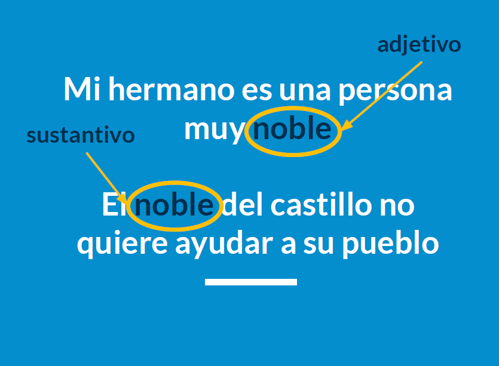
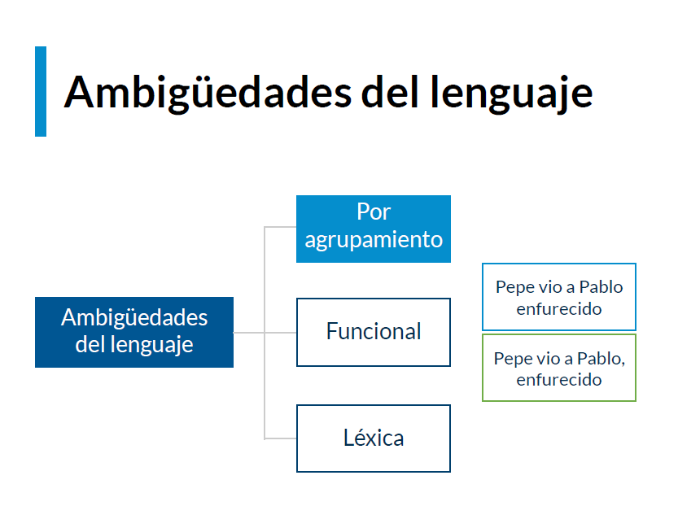
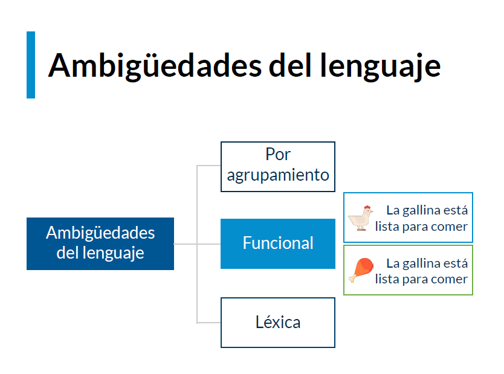
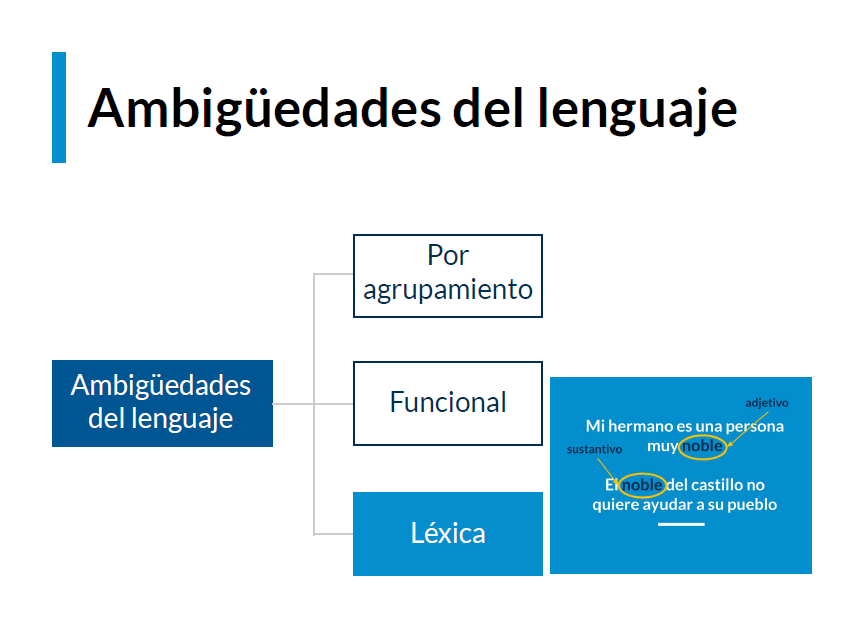
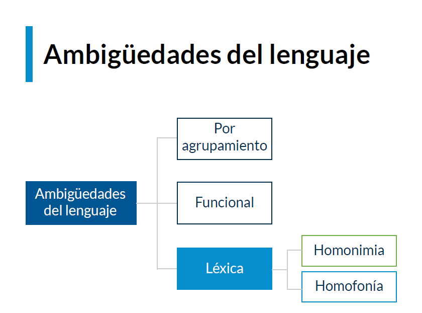
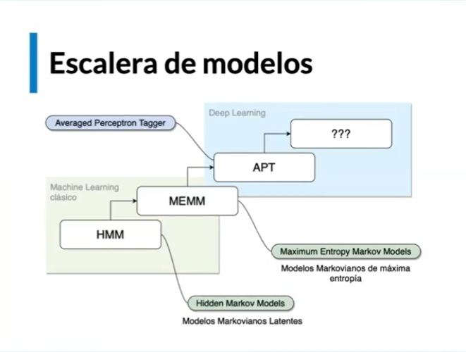
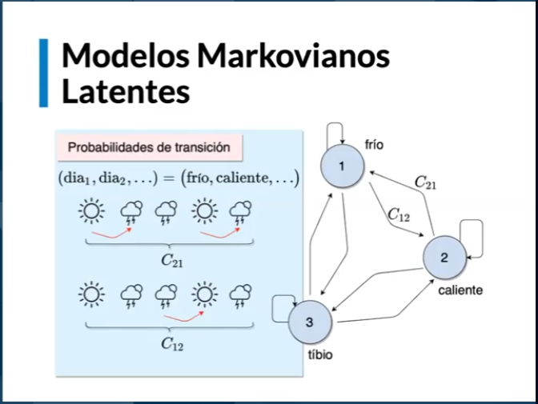

# Curso de Algoritmos de Clasificación de Texto

[Notas de alumnos](https://github.com/rb-one/Curso_Algoritmos_Clasificacion_Texto/blob/main/Notas/notes.md)


## Clase 1 Introducción a la desambiguación

el lenguaje humano es my difuso y ambiguo por lo cual requiere mucho contexto, para nosotros es muy facil hacerlo pero para las maquinas es una tarea muy compleja.

Ejemplos:




### Ambigüedades del lenguaje

Existen multiples tipos:

Por agrupamiento: signos de puntuació.



Funcional: por el contexto en que se dice la palabra.



Lexica: por la forma de su estructura la misma palabra puede ser verbo, adjetivo, sustantivo, etc.





Como etiquetar apropiadamente una palabra

[API de Google Natural Language](https://cloud.google.com/natural-language)


en este curso veremos algoritmos que no utilizan redes neuronales pero aun asi son muy potentes.

Aplicaciones posibles:

- Mejoras en motores de búsqueda, e-commerce y web.

- Automatización en manejo de CRMs.

- Censura en redes sociales.

- Orden de datos no-estructurados


## Clase 2 Etiquetado rápido en Python: español e inglés

en la clase anterior vimos que el problema grande del procesamiento de lenguaje natural es la Ambigüedad

https://colab.research.google.com/drive/1GLrHVS5aXHD_0ZWpYzKLIOUA6Xono6gt?usp=sharing

## Clase 3 Etiquetado rápido en Python: Stanza (Stanford NLP)

Uso de stanza para el etiquetado de texto

## Clase 4 Cadenas de Markov

bases teoricas utilizadas en la creacion de Stanza

```python
import nltk
nltk.download('punkt') # tokenizer tokenizador
nltk.download('averaged_perceptron_tagger') # tagger etiquetador
from nltk import word_tokenize
```

los tokenizer y tagger por defecto en ingles son:

**Punkt** es una palabra alemana que significa puntuacion y es un algoritmo de tokenizacion crado por programadores alemanes en 2016

**Averaged perceptron tagger** es un etiquetador por perceptron promediado



Una escalera de modelo no es necesariamente lo estandar al realizar etiquetado pero es el camino que seguiremos en esta etapa del curso.



las cadenas de markov son cadenas de estados finitos, en este caso las palabras, que se pueden representar como grafos dirigidos.

### Recurso de alumnos


## Clase 5 Modelos Markovianos latentes (HMM)

Material de lectura

[NLP: Pretrained Named Entity Recognition (NER)](https://medium.com/@b.terryjack/nlp-pretrained-named-entity-recognition-7caa5cd28d7b)

### Modelos markovianos latentes

Se ve genial el punto en donde da la explicación del uso de los modelos Markovianos en el etiquetado de palabras. Algo que encontré y me sirvió mucho es la siguiente definición.

La cadena de Markov es una serie de eventos, en la que la probabilidad de que ocurra un evento depende del evento anterior. Este tipo de cadenas tienen memoria.

Este tipo de calculos se logra utilizando el teorema de Bayes.

Sea  ${\displaystyle \{A_{1},A_{2},...,A_{i},...,A_{n}\}}$ un conjunto de sucesos mutuamente excluyentes y exhaustivos tales que la probabilidad de cada uno de ellos es distinta de cero ${\displaystyle (\operatorname {P} [A_{i}]\neq 0\; \text{ para }  i=1,2,\dots ,n)}$ Si $B$ es un suceso cualquiera del que se conocen las probabilidades condicionales ${\displaystyle P(B|A_{i})}$ , entonces la probabilidad $P(A_i|B)$ entonces la probabilidad $P(A_i|B)$ viene dada por la expresión:

$${\displaystyle P(A_{i}|B)={\frac {P(B|A_{i})P(A_{i})}{P(B)}}}$$

donde:

$P(A_i)$ son las probabilidades a priori,
$P(B|A_i)$  es la probabilidad de $B$ en la hipótesis $A_i$,
$P(A_i|B)$  son las probabilidades a posteriori.

### HMM (Hidden Markov Model)

Pensemos en secuencia de palabras y secuencia de etiquetas de cada una de esas palabras.

(pedro, es, ingeniero) | (sustantivo, Verbo, Sustantivo)

Esto es una cadena latente (oculta)y el propósito del modelo es descubrir o encontrar cual es esa cadena.
